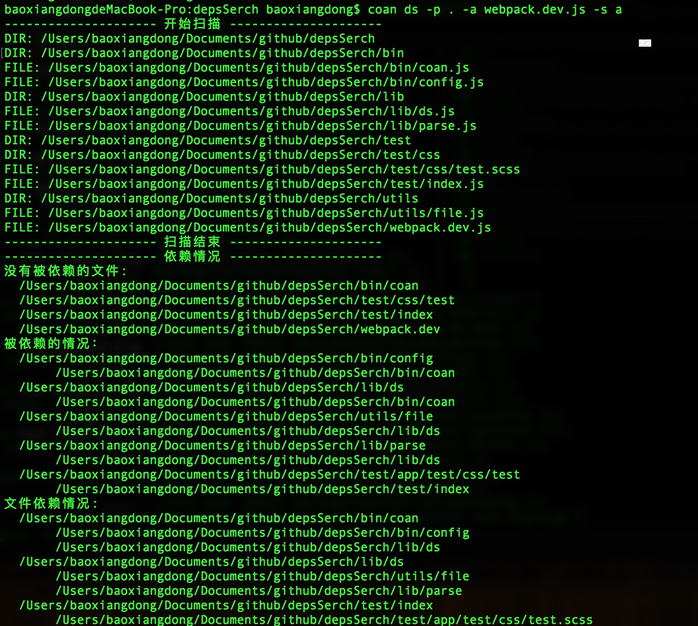

## 文件依赖检索，可以检索文件夹所有文件的依赖情况，并提供以下功能：
* 分析出项目中那些文件没有被使用
* 一个文件被那些文件使用了
* 根据依赖情况和入口文件参数给出文件是否可删除的建议
* 统计可删除文件的大小
* 删除代码中无用的变量（慎用）

该工具适用于项目越做越大，不好管理，需要净化代码，净化项目文件的时候，或者其他场合。

*注意*：使用anu命令时需要项目中存在eslint配置文件，之所以没有给出默认的配置，我相信规范的项目代码是需要eslint的


## 使用

* 安装依赖

```
npm i -g depsserch

```

* 命令ds
 
```
coan ds

文件依赖检索

选项：
  --version        显示版本号                                           [布尔]
  -h, --help       显示帮助信息                                         [布尔]
  --path, -p       扫描路径                                            [字符串] [必需]
  --aliaspath, -a  alias配置文件路径                                    [字符串]
  --show, -s       信息显示类型, a: 显示所有；o: 是显示没有被依赖的文件       [字符串]
  --input, -i      项目入口文件文件夹路径                                 [字符串]
  --config, -c     配置文件路径                                         [字符串]

参数解释:
-p: 要扫描的文件夹路径
-a: alias配置文件路径(webpack.config.js路径)
-s: 信息显示类型, a: 显示所有；o: 是显示没有被依赖的文件
-i: 入口文件

```
当添加入口文件参数，会分析那些文件可以删除， 否则只分析文件依赖情况。config配置如下：

```
module.exports = {
    aliaspath: './webpack.dev.js',
    show: 'o',
    input: [
        './test/A.js',
        './test/B.js',
    ]
}

```
可以配置三个参数：aliaspath、show、input


* 命令anu

```
选项：
  --version   显示版本号                                          [布尔]
  -h, --help  显示帮助信息                                        [布尔]
  --path, -p  扫描路径                                            [字符串] [必需]
  --func, -f  是否替换函数, 如果需要替换，建议函数注释中没有"{"或者"}"
                                                                 [布尔] [默认值: false]
```
该命令的作用是：分析出那些变量没有被使用，并自动删除变量（慎用）。这里的变量包括var、const、import或者定义的函数。默认不会检索函数变量，因为函数变量的定义不好获取（函数中可能包含注释，或者字符串），如果使用建议函数定义中不要在注释中或者字符串中存在 "{","}" 字符


* 示例1 -- ds命令

```
baoxiangdongdeMacBook-Pro:depsSerch baoxiangdong$ coan ds -p . -a ./webpack.dev.js -s o -i ./test/
--------------------- 开始扫描 ---------------------
DIR: /Users/baoxiangdong/Documents/github/depsSerch
DIR: /Users/baoxiangdong/Documents/github/depsSerch/bin
FILE: /Users/baoxiangdong/Documents/github/depsSerch/bin/coan.js
FILE: /Users/baoxiangdong/Documents/github/depsSerch/bin/config.js
DIR: /Users/baoxiangdong/Documents/github/depsSerch/lib
FILE: /Users/baoxiangdong/Documents/github/depsSerch/lib/anu.js
FILE: /Users/baoxiangdong/Documents/github/depsSerch/lib/config.js
FILE: /Users/baoxiangdong/Documents/github/depsSerch/lib/ds.js
FILE: /Users/baoxiangdong/Documents/github/depsSerch/lib/parse.js
DIR: /Users/baoxiangdong/Documents/github/depsSerch/test
FILE: /Users/baoxiangdong/Documents/github/depsSerch/test/A.js
FILE: /Users/baoxiangdong/Documents/github/depsSerch/test/B.js
FILE: /Users/baoxiangdong/Documents/github/depsSerch/test/C.js
FILE: /Users/baoxiangdong/Documents/github/depsSerch/test/D.js
FILE: /Users/baoxiangdong/Documents/github/depsSerch/test/common.js
DIR: /Users/baoxiangdong/Documents/github/depsSerch/test/css
FILE: /Users/baoxiangdong/Documents/github/depsSerch/test/css/test.scss
DIR: /Users/baoxiangdong/Documents/github/depsSerch/test/imgs
FILE: /Users/baoxiangdong/Documents/github/depsSerch/test/imgs/demo.jpg
FILE: /Users/baoxiangdong/Documents/github/depsSerch/test/index.js
DIR: /Users/baoxiangdong/Documents/github/depsSerch/utils
FILE: /Users/baoxiangdong/Documents/github/depsSerch/utils/file.js
FILE: /Users/baoxiangdong/Documents/github/depsSerch/utils/utils.js
FILE: /Users/baoxiangdong/Documents/github/depsSerch/webpack.dev.js
--------------------- 扫描结束 ---------------------
--------------------- 依赖情况 ---------------------
没有被依赖的文件: 
  /Users/baoxiangdong/Documents/github/depsSerch/bin/coan.js
  /Users/baoxiangdong/Documents/github/depsSerch/test/A.js
  /Users/baoxiangdong/Documents/github/depsSerch/test/C.js
  /Users/baoxiangdong/Documents/github/depsSerch/test/common.js
  /Users/baoxiangdong/Documents/github/depsSerch/test/css/test.scss
  /Users/baoxiangdong/Documents/github/depsSerch/test/imgs/demo.jpg
  /Users/baoxiangdong/Documents/github/depsSerch/test/index.js
  /Users/baoxiangdong/Documents/github/depsSerch/webpack.dev.js
可删除的文件
  /Users/baoxiangdong/Documents/github/depsSerch/bin/coan.js
  /Users/baoxiangdong/Documents/github/depsSerch/bin/config.js
  /Users/baoxiangdong/Documents/github/depsSerch/lib/ds.js
  /Users/baoxiangdong/Documents/github/depsSerch/lib/anu.js
  /Users/baoxiangdong/Documents/github/depsSerch/utils/file.js
  /Users/baoxiangdong/Documents/github/depsSerch/lib/config.js
  /Users/baoxiangdong/Documents/github/depsSerch/utils/utils.js
  /Users/baoxiangdong/Documents/github/depsSerch/lib/parse.js
  /Users/baoxiangdong/Documents/github/depsSerch/webpack.dev.js
可删除文件数:9
可删除文件大小:26.4033203125KB
```

* 示例2 -- anu命令

```
baoxiangdongdeMacBook-Pro:depsSerch baoxiangdong$ coan anu -p ./test/
/Users/baoxiangdong/Documents/github/depsSerch/test/B.js
删除的内容：
import D from './D';

```


